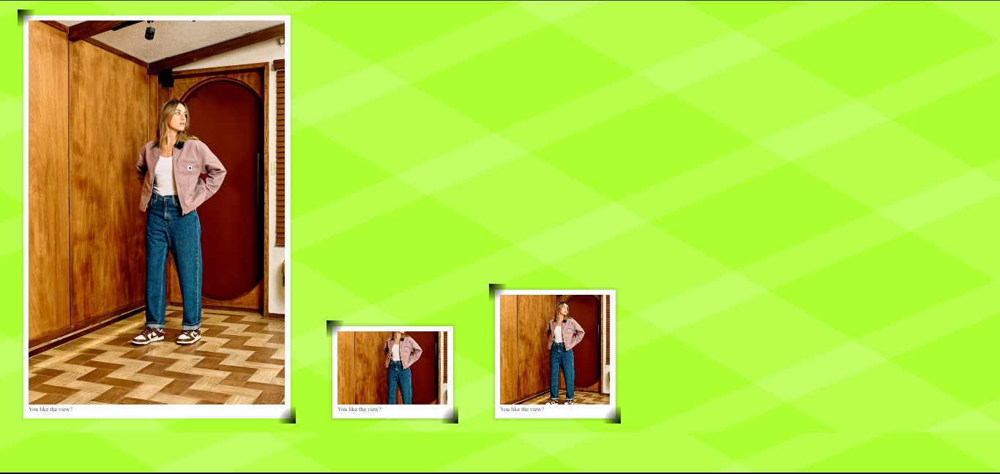

# Worked on Alvaro Montoro Cut-Corners Photo
I saw the code on Kevin Powell's Youtube channel and chose to try it out.
It caught my attention and discovered that I could give it a try.

## My Experience Making It Working
1. I went online, and found an image I could use to implement the code(https://images.unsplash.com/photo-1706550631672-15f4502b7527?w=700&auto=format&fit=crop&q=60&ixlib=rb-4.0.3&ixid=M3wxMjA3fDB8MHxlZGl0b3JpYWwtZmVlZHw0fHx8ZW58MHx8fHx). 
2. After placing the image in the figure tag, I decided to duplicate the image. 
3. The next step was the css file(I included the body style, the figure style)

### My Challenge
1. My first challenge was getting to know how multiple radical-gradient works. I had to understand along the line when I was done with the last implementation.
2. I seem to have forgotten how clip-path works, I had to go back to study it again.

#### Inconclusion
it was a fun and challenging experience.

##### Output

